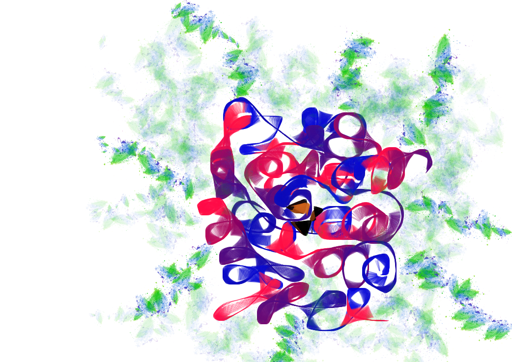

.. _getting_started:

***************
Getting started
***************

.. _installing-docdir:

Setting up Sphinx for documenting start-to-end simulation
=========================================================

You need clone the start-to-end repository from GitHub::

  git clone https://github.com/chuckie82/start-to-end.git

The index.rst is the master ReST for your project.

You may already have sphinx `sphinx <http://sphinx.pocoo.org/>`_
installed -- you can check by doing::

  python -c 'import sphinx'

If that fails grab the latest version of and install it with::

  > sudo easy_install -U Sphinx

Let's see if we can build our html::

  make html

If you now point your browser to :file:`_build/html/index.html`, you
should see the site.

To update the document on the web, just push your changes::

   git add *.rst
   git commit -m "Update all documents"
   git push -u origin master

.. image:: _static/undulator.png
    :scale: 33 %

Installing your start-to-end package
====================================

