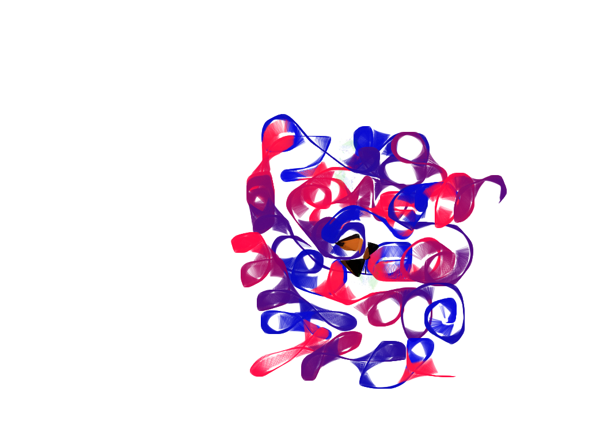

.. simS2E documentation master file, created by
   sphinx-quickstart on Fri Jan  9 12:44:40 2015.
   You can adapt this file completely to your liking, but it should at least
   contain the root `toctree` directive.

Welcome to simS2E's documentation!!!
===================================

**[ Documentation is under construction ]**
-------------------------------------------

Contents:

.. toctree::
   :maxdepth: 2

   docs/getting_started.rst
   docs/quick_demo.rst
   docs/fel_source_simulation.rst
   docs/propagation.rst
   docs/photon_matter_interaction.rst
   docs/coherent_diffraction.rst
   docs/orientation_determination.rst
   docs/phasing.rst

Indices and tables
==================

* :ref:`genindex`
* :ref:`modindex`
* :ref:`search`

