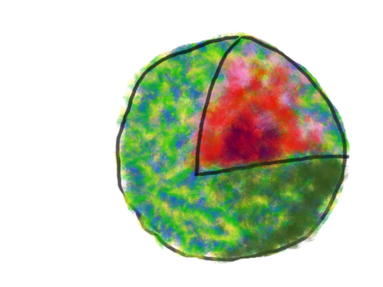

.. _orientation_determination:

Orientation Determination
=========================

Input/Output data description
-----------------------------

The input/output data is expected in hdf5 format, and the glossary can be found below. Orientation determination module is responsible for reading in and writing out in the format specified below.

orient_out_<7 digit ID>.h5 (Output HDF glossary)
^^^^^^^^^^^^^^^^^^^^^^^^^^^^^^^^^^^^^^^^^^^^^^^^

+--------------------------+---------------------------------------------------------------------+-----------+----------+
| Field name               | Description                                                         | Data type | Units    |
+==========================+=====================================================================+===========+==========+
| **data/**                |                                                                     |           |          |
+--------------------------+---------------------------------------------------------------------+-----------+----------+
| data/data                | Diffraction volume in 3D array (dimX x dimY x dimZ)                 | Float     |          |
+--------------------------+---------------------------------------------------------------------+-----------+----------+
| data/angle               | Most likely orientation                                             | Float     |          |
+--------------------------+---------------------------------------------------------------------+-----------+----------+
| data/center              | center of diffraction volume x,y,z                                  | Int       | pixels   |
+--------------------------+---------------------------------------------------------------------+-----------+----------+
| **params/**              | Parameters used for coherent diffraction                            |           |          |
+--------------------------+---------------------------------------------------------------------+-----------+----------+
| params/info              | Input for orientation determination program and version             | String    |          |
+--------------------------+---------------------------------------------------------------------+-----------+----------+
| **history/**             | Information about input data                                        |           |          |
+--------------------------+---------------------------------------------------------------------+-----------+----------+
| **info/**                | Information                                                         |           |          |
+--------------------------+---------------------------------------------------------------------+-----------+----------+
| **misc/**                | Miscellaneous information                                           |           |          |
+--------------------------+---------------------------------------------------------------------+-----------+----------+
| **version**              | hdf5 format version                                                 | Float     | 0.1      |
+--------------------------+---------------------------------------------------------------------+-----------+----------+

